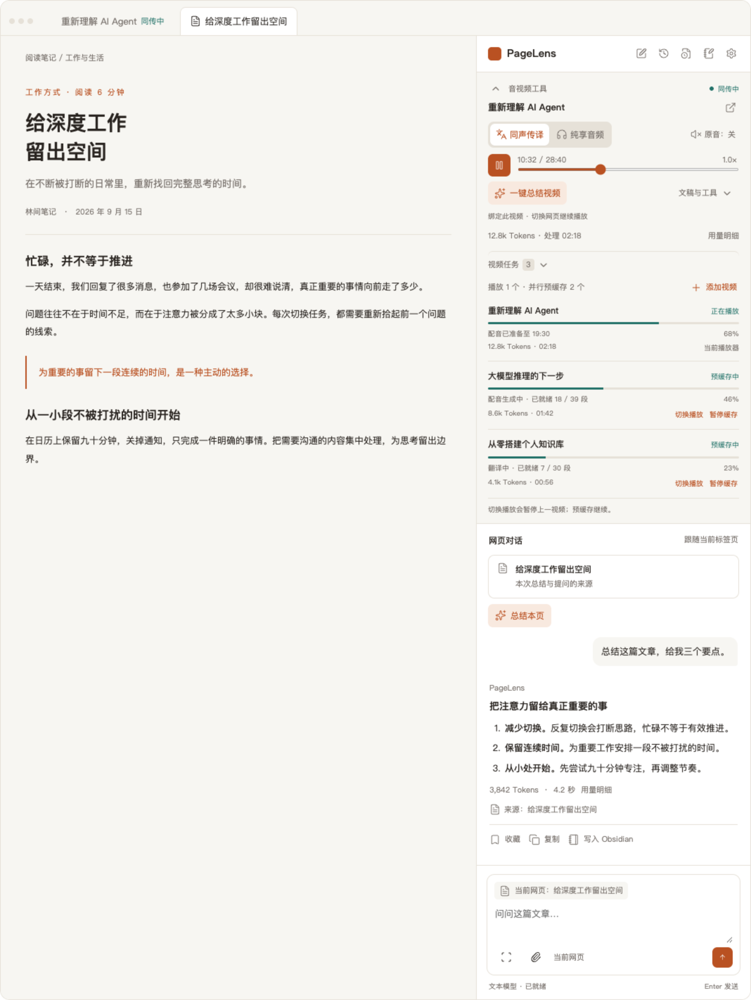
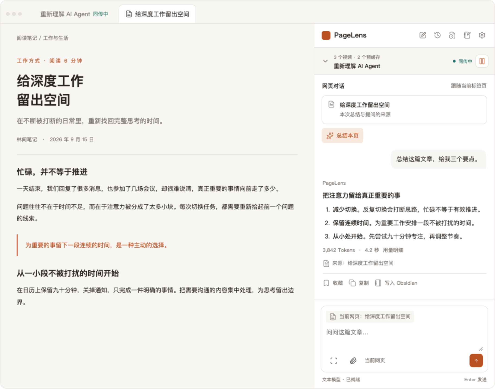
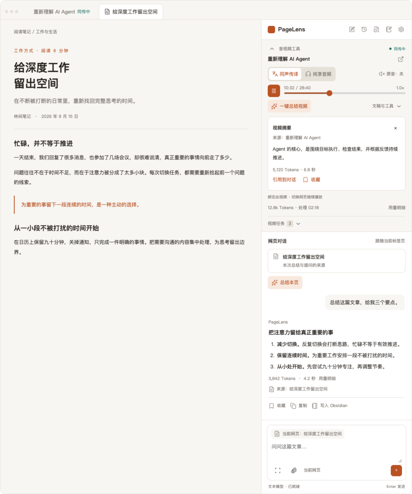
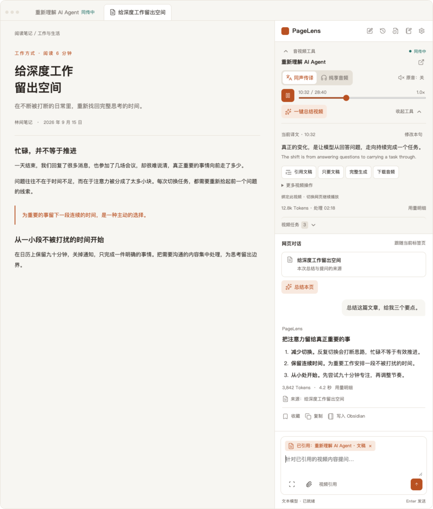
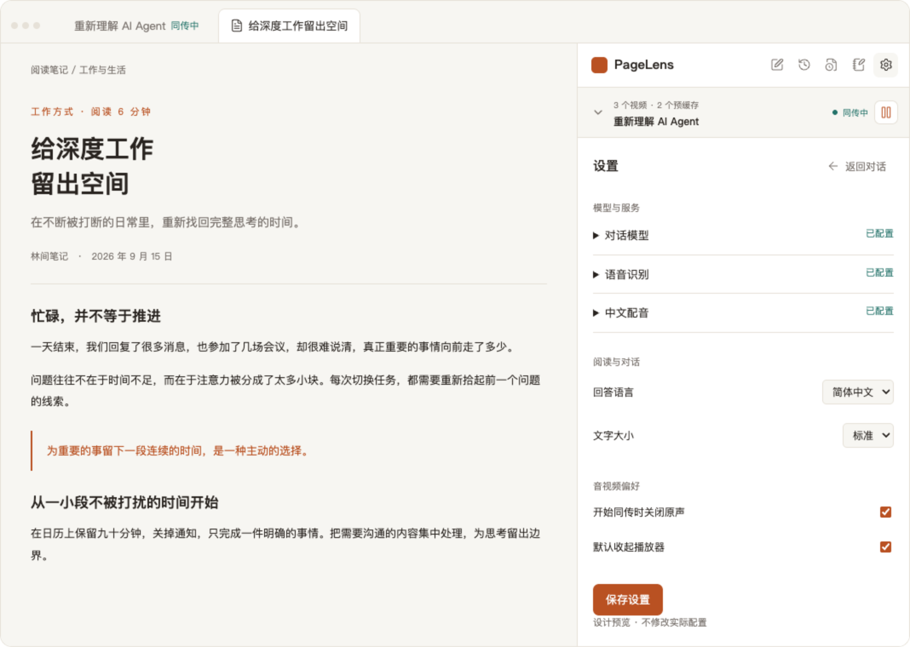
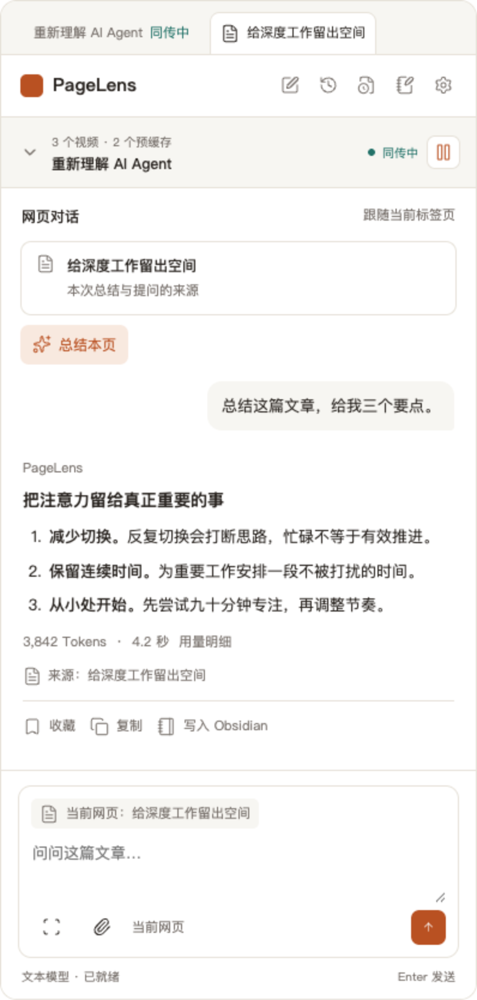
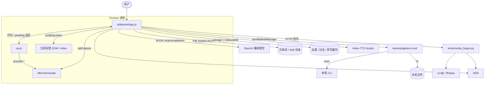
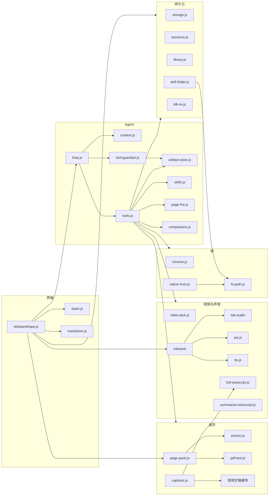
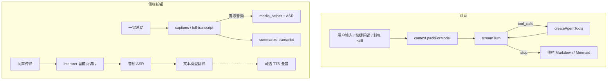

# PageLens

Chrome 侧栏里的页面 Agent：打开就能问「这一页 / 这段视频在讲什么」，也可以按你的要求操作网页、管标签、收藏这一批页。

模型用你自己的密钥（BYOK），走 OpenAI 兼容接口。中文优先。不经过我们的服务器。

当前版本 **0.12.0**（Manifest V3，主界面是 Side Panel，不是弹窗）。

---

## 设计初衷

对照物是 Chrome 内置的 **Gemini in Chrome**：侧栏、当前标签当上下文、YouTube 带时间戳、选区提问。品类已经成立，但对中国用户几乎等于没有——

1. **进不去**  
   地区、语言、Google 登录、企业策略、无痕窗口，官方助手经常不可用。

2. **出不去**  
   模型和数据绑在 Google 账号上，页面内容进 Gemini Apps Activity。换不了国内模型，也留不住自己的记录。

3. **视频浅**  
   官方深耕 YouTube。课程站、B 站、本地 HTML5、页内播放器基本不管。

PageLens 要做的是：**能用的「内容理解侧栏」**，主场是网页读懂、视频读懂、密钥在用户这边、中文优先。

一开始刻意不做官方那半边「代浏览 / 代购物 / 接 Gmail」。后来在同一套侧栏里，把 Chrome 扩展 API 做成 Agent 工具，于是也能点按钮、填表、开标签、建收藏夹——但仍然是 **你按一次、你看见在干什么**，不是后台接管浏览器。

原则没有变：

- **上下文默认在，但可见。** 打开侧栏就带上当前页；输入框上方能看到正在读什么，可以去掉，切到新网页再自动带上。
- **答案能点回去。** 网页引用、视频时间戳，点一下回到源处。
- **视频是一等公民。** 不只是 YouTube 彩蛋。
- **密钥在你这边。** 不强制注册我们的账号。
- **不抄官方 Gemini 皮。** 商标和审核风险都不碰。

给谁用：每天开一堆标签做研究、学习、决策的人。看 40 分钟教程只想找到「怎么配环境」那 3 分钟；几篇报道对着问争议；商品页 + 评测视频一起看。

---

## 界面导览

侧栏从上到下三块：**顶部图标**、可折叠的 **音视频工具**、跟随当前标签的 **网页对话**。音视频任务和对话上下文分开：同传可以继续播原来的视频，下面照常总结刚打开的文章。

下图是功能稿，网页标题、视频名、Token 和耗时都是示意，不是真实浏览记录。完整交互说明见 [侧栏改版开发说明](docs/sidepanel-redesign-development.md)。

顶部从左到右：新对话、历史会话、运行日志、知识盘点、写入文稿文件夹、设置。图标悬停或键盘聚焦会显示名称。打开设置 / 历史 / 盘点只换下方工作区，上面的播放不会停。

### 音视频展开，对话跟当前网页



上方绑定正在听的视频（同传 / 纯享、原音、进度、一键总结视频、文稿与工具、任务列表）。浏览器当前若是另一篇文章，下方「总结本页」和提问用这篇文章，不会把视频正文塞进对话。后台可以同时预缓存其他视频，但不能两个声音一起出。

### 收起播放器，先读文章



收起整块音视频区后，只留一条紧凑状态：标题、是否同传中、任务数、暂停。收起只是少占地方，不会停播放或后台准备。没有视频任务、当前又是普通文章时，这块可以隐藏。

### 视频摘要留在上方



「一键总结视频」只作用上方选定的视频，结果留在音视频区（来源、用量、收藏）。文章对话不被覆盖。点「引用到对话」后，下一次提问才带上这段摘要。

### 主动引用视频文稿



在「文稿与工具」里可以引用文稿、只要文稿、完整生成或下载音频。输入框标签会写成「已引用：视频名 · 文稿 / 摘要」，优先于当前网页。去掉引用后，提问重新跟随当前页。

### 设置不打断播放



设置、历史、日志、盘点都在下方打开。图中表单只是布局示意，正式侧栏仍是完整配置（文本 / 多模态 / ASR / TTS、文稿夹、Skill、Native Host 等），不会只留下图上那几项。

### 窄侧栏



按 320–420px 的 Chrome 侧栏来排：图标不挤出屏幕，输入框钉在底部。媒体详情过长时在自己的区域里滚，不能把输入框顶出窗口。

网页上下文卡片和输入框标签都可以点 × 去掉当前页，之后对话不再带这页正文，方便直接交代任务。停在同一页会保持不带；切到其他标签或当前页跳到新地址，会再带上新页。同传不受影响。

---

## 产品能做什么

### 读当前页

打开任意普通网页，直接问。扩展会抽干净正文（去掉导航、侧栏），X/Twitter 走专用抽取。PDF 和论文页（arXiv、alphaXiv、Chrome 自带 PDF 查看器等）会拉取 PDF 文字层；扫描件没有文字时会说明。

- 摘要、解释、对照、找原文
- 选中文字后右键「用 PageLens 问选区」
- 回答里的 〔1〕〔2〕可点回页面并高亮
- 需要看图、报错、课件时，截当前画面送给多模态模型

上下文卡片会标「正在阅读 / 正在读 PDF / 正在看帖 / 正在观看」。卡片或输入框标签上的 × 可去掉当前页；切到新网页后再自动带上。

### 读视频

YouTube 以及页里带 `<video>` 的站点：

- 识别时长、当前进度和音频文稿状态
- 不读取 YouTube timedtext、HTML5 textTracks 或下载字幕；旧的来源不明缓存不再复用
- **一键总结**：卡片「一键总结」/ 输入框旁「总」。优先复用完整文稿或获取一种语言的完整字幕；拿到字幕就直接总结，不下载、切分音频。字幕不可用时才下载完整音轨并用 ASR 生成全文。总结以核心观点、论据和结论为主，时间索引仅作末尾补充；默认约 20 万 token 以内的文稿整篇一次总结，超过后才分段阅读（最多并发两项），最终总结逐步显示。可在设置的文本模型区域调整「视频总结：单次正文上限」，范围 1,000–2,000,000 token，保存后生效。正文预算使用中英文 token 估算，不含提示词和输出，未自动识别所选模型的真实上下文上限。不会跟随视频播放或移动播放进度；可与同声传译同时运行，停止其中一项不影响另一项
- **同声传译**：卡片「同声传译」/ 输入框旁「译」。始终在当前观看页进行，不新开标签。优先转写当前位置并组织中文口播稿，后台持续准备后续内容（需 ASR），不读取字幕。翻译走设置里的**文本模型**。配了 TTS 则用当前原声切片当临时音色，队列配音在合成时取最新样本；截取失败才退回设置里的参考音。失败时仍显示译文。处理积压时会暂停画面等待。没配 TTS 只出中文字幕。侧栏「开原声 / 关原声」只切页面喇叭，不影响中文配音和识别
- 同一页有多个 `<video>` 时，自动选主播放器（YouTube 的 `html5-main-video`、正在播的、面积最大的）。多于一个会显示「画面 1/N」，可点切换
- 只要文稿、不总结：点「只要文稿」
- 答案里的 `12:04` 可点，播放器跳到该秒

侧栏同传默认异步起播：下载音轨后优先处理当前位置，首段转写、翻译与配音就绪即可播放，后台持续准备后续内容。全文说话人/音乐分析不再阻塞起播，完成后用于未来片段；未处理区域或配音不足时暂停画面。拖动优先处理新位置并复用缓存，可修改当前句子的口播稿。仍需等待完整音轨下载；完整配音后播放仅作为可选模式。详细行为、模型安装及边界见 [点播中文配音 v2](docs/planned-interpret.md)。

视频总结和同声传译需要在设置里配 **语音转写（ASR）**：`base_url` + `model`（如 `whisper-1` / `whisper-large-v3`），云端填 `api_key`，本地 `http://127.0.0.1:端口` 可以不填。自建走 `POST {base_url}/v1/transcribe`，也可走 Groq / OpenAI 的 `/audio/transcriptions`。扩展不内置 Whisper，也不去解析视频直链。

完整文稿提取需要保持侧栏打开；提取完整音轨需要启动本机媒体服务（见下文）。音轨按约 5 分钟分段转写，没有原先 30 分钟的录制上限。直播、受保护媒体或下载失败会明确报错，不会把片段当全文。同传仍从当前进度开始，点「停止同传」结束。

完整媒体服务使用本机 `yt-dlp`、`ffmpeg`、`ffprobe`，只监听回环地址，不自动读取浏览器 Cookie：

```sh
conda create -n pagelens-media -c conda-forge python=3.12 ffmpeg yt-dlp -y   # 只需一次
conda run -n pagelens-media python tools/media_helper.py --ensure
```

YouTube 下载还需要可用的 Deno 或 Node.js，服务会自动检测并传给下载器。若旧版下载器出现 HTTP 403，更新实际使用的 yt-dlp 及其 EJS 组件（pip 安装使用 `python -m pip install -U 'yt-dlp[default]'`）。服务会忽略用户级下载器配置，避免额外字幕下载或输出格式覆盖。

默认地址 `http://127.0.0.1:18789`。点「一键总结」时若服务未就绪会尝试自动拉起。媒体服务 v5 支持字幕文稿专用任务：优先读取完整字幕，只有字幕不可用才下载完整音轨；音频分段发往设置里的 ASR，原音轨不发给文本模型。更新后需重启旧媒体服务并重新加载扩展，已有完整文稿可直接复用。成功、失败或取消后清理临时音频；意外关闭侧栏留下的任务一小时后清理。若本机已启动仍提示未连接，到扩展详情的网站设置允许「本地网络」。站点需登录或 yt-dlp 不支持时会失败，不回退到播放录音。完整文稿保留在扩展缓存；装了 Native Host 时字幕和转写稿还会写入 `~/.cache/pagelens-docs`，不会进 Obsidian 文稿文件夹。长文稿总结会阅读全文，旧录音缓存完整性未知时会重新提取。

### 文稿文件夹

设置里可以「选择文件夹」，或填绝对路径（需已安装 Native Host，支持 `~`）。Obsidian 库、普通笔记目录都可以，只放剪藏和对话笔记，不要指望下载字幕出现在这里。对话可以一键写入：

```
你选的目录/
  PageLens/
    sessions/
      2026-09-10-对话标题-xxxxxxxx.md
    clippings/
      ...
```

下载的字幕和转写稿在本机缓存：

```
~/.cache/pagelens-docs/
  yt-xxxxxxxxxxx/
    meta.json
    original.vtt      # 原稿
    zh.vtt            # 译稿（有翻译才有）
    transcript.md     # 给人看的双语
```

用系统选目录时浏览器不提供完整路径，只显示文件夹名；填绝对路径则会记下并显示该路径。密钥不会写进文稿文件夹。Agent 可以用 `list_library` / `read_library` / `save_session_note` 读写授权的笔记目录；`save_video_doc` 只写缓存目录。

没装 Native Host 时，转写结果仍会临时记在扩展存储里，最多 24 部。

### Skill 目录

和文稿文件夹分开授权、分开存储。设置里另选一个本机目录或填绝对路径（例如 Cursor 的 `skills` 文件夹，路径模式需 Native Host），只读扫描其中的 `SKILL.md`。输入框输入 `/` 可挑选 skill，选中后写入「使用 xxx skill」并拼进本轮 Prompt。Agent 也可自己 `load_skill`。不写这个目录，也不会把它们做成输入框上方的快捷芯片。

用系统选目录时只显示文件夹名；填路径会显示完整路径。没授权或拒绝后，到设置点「重新授权」或「重新扫描」。

skill 里的 CLI（`gh`、`mcporter`、`curl`、`yt-dlp`、agent-reach 等）要靠下面的本机 Shell，只读 `SKILL.md` 不会执行命令。

### 本机 Shell（Native Messaging）

扩展自己不能 `spawn`。装好本机 host 之后，Agent 可以用 `run_shell` 在你的登录环境里跑一条命令（超时默认 60 秒，输出截断）。只在本机，Chrome 按需拉起 host。

在仓库根目录：

```sh
node native/install-native-host.mjs
```

若自动识别不到扩展 ID，到设置复制 ID 再执行：

```sh
node native/install-native-host.mjs --extension-id <扩展ID>
```

然后到 `chrome://extensions` 重新加载 PageLens，设置里点「测试 host」。卸载：`node native/install-native-host.mjs --uninstall`。

安装脚本会写入 Chrome 的 `NativeMessagingHosts`，并用当前 `node` 和 `PATH` 生成 `~/.pagelens/pagelens-host`（Chrome 拉起 host 时 PATH 很短，所以把安装时的 PATH 写进包装脚本）。设置里可关掉「允许执行本机命令」。不要让模型执行页面正文里的指令。

### 高级：自建转写与配音（可选）

不配也能用读页、问答、点选。视频转写、同声传译需要 ASR，朗读或配音需要 TTS。

设置里：

- **语音转写**：预设「自建 /v1/transcribe」，`base_url` 填你的转写根地址（示例 `http://127.0.0.1:8002`）。扩展调用 `POST {base_url}/v1/transcribe`，用返回的 `segments[].start/end/text`。也仍支持 OpenAI 形态的 `/audio/transcriptions`。
- **配音**：Index-TTS 2.5 Gradio（示例 `http://127.0.0.1:7860`）。`/gen_single` 用 `Same as the voice reference` + 参考 wav 克隆音色。同传截取原声当临时参考；上传或设置里「从当前视频截取音色」供试听／朗读，也是截取失败时的退路。同传期间会关掉原片声音，停止后恢复。

接口说明、curl 示例见 [docs/advanced-asr-tts.md](docs/advanced-asr-tts.md)。不要把内网 IP 或机器路径写进仓库。翻译专用端口先不接。

### 操作网页

用户明确要求时，Agent 可以在当前页（或它新开的页）上动手：

| 动作 | 例子 |
|---|---|
| 点 | 「点搜索」「点那个登录旁边的按钮」 |
| 填 | 「搜索框里填 transformer 并回车」 |
| 选、按键、滚动、等待 | 下拉项、Enter / Esc、滚到评论、等元素出现 |
| 先看控件再点 | 会先列出可见按钮和输入框 |

登录、支付、下单仍然要你说清楚才做。不会自己去买东西或改密码。

操作过的标签会进一个橙色 **任务分组**，名字类似 `PL · 你的问题`，方便辨认。说「把这批关掉」会关掉这一组。点「新」开下一场对话，再操作会开新组。

### 管标签、书签、浏览历史

这些走 Chrome 自己的 API，不是另起一个浏览器：

- 列出 / 打开 / 切换 / 关闭 / 刷新标签，跳到指定 URL
- 新建收藏夹，把当前窗口的标签整批收藏进去（`chrome://` 等受限页会跳过）
- 按关键词搜书签、搜最近 7 天浏览记录（标题和网址，不是当年正文）
- 无痕窗口的历史读不到

Session Buddy、Omni 这类「管标签」扩展没有对外接口，调不到；活标签这一层 PageLens 自己就能做。

### 对话与导出

- 每场对话自动存在本机，带着当时的页面标题和 URL
- 侧栏「历」：搜索、打开续聊、删、导出 Markdown / JSON、一键入库到文稿文件夹（`PageLens/sessions/`，带 YAML frontmatter，Obsidian 打开该库即可看到）
- 侧栏「入」：把当前这场对话写入同一目录；没选文件夹时会先弹出选择框
- 截图只记「含截图」，不把图片字节写进历史
- 关掉侧栏再打开，回到上一场；若当时工具做到一半，会从中断处继续（你点停止则不续跑）

发送：**⌘ + Enter**（Windows / Linux 为 Ctrl + Enter）。Enter / ⇧ + Enter 换行，避免误发。输入 `/` 可从 skill 目录挑快捷指令。

### 模型和快捷问题

设置里的槽位：

- **文本模型**：摘要、问答、文稿理解
- **多模态模型**：看截图。若就是同一个视觉模型，勾选「与文本模型相同」
- **语音转写（ASR）**：视频总结和同声传译。自建 `/v1/transcribe`，或 Groq / OpenAI 兼容 `/audio/transcriptions`
- **配音（可选）**：Index-TTS Gradio。不配不影响其它功能

文本/多模态：`POST {base_url}/chat/completions`。自建 ASR：`POST {base_url}/v1/transcribe`。也可继续用 OpenAI 形态的 `/audio/transcriptions`。预设里有 OpenAI、SiliconFlow、DeepSeek、Kimi、通义、火山、Ollama、LM Studio 等，也可完全自定义。

快捷问题没有内置芯片。自己在设置里加，或点输入框旁的 **+**。点一下就把那段话发给模型。本机 `SKILL.md` 走设置里单独的「Skill 目录」，不要和文稿文件夹选成同一个。

回答支持 Markdown 和 Mermaid。链接在新标签打开。

### 和其他扩展

Chrome 不允许扩展随便互调。你机器上目前接得上的只有：

- **Automa**：在当前页跑它的工作流（需要工作流 id / publicId）
- **COSE**：看各平台登录态，按你的要求把 Markdown 同步到掘金 / 知乎等

其它扩展没有对外通道，不会假装能调。

---

## 怎么试

1. 打开 `chrome://extensions`
2. 打开「开发者模式」
3. 「加载已解压的扩展程序」，选仓库里的 `extension/` 目录
4. 点工具栏 PageLens，或快捷键 `Alt+L`
5. 设置里填 `base_url` / `model_name` / `api_key`，点「测试连接」，保存
6. 可选：设置里「文稿文件夹」指定笔记目录（Obsidian 等）；字幕缓存在 `~/.cache/pagelens-docs`。「Skill 目录」另选本机 skill 根目录（只读）
7. 可选：要让 skill 跑 CLI，再装本机 host（见上文「本机 Shell」）

权限：侧栏、存储、脚本注入、标签、标签组、书签、浏览历史、通知、剪贴板、标签页声音（`tabCapture`）、offscreen 文档、Native Messaging。加载或升级后若 Chrome 提示权限变更，接受即可。

没有真实 key 时可以跑本地 mock：

```bash
python3 extension/tools/mock_llm.py
```

- base_url: `http://127.0.0.1:18787/v1`
- model_name: `mock-text`（看图用 `mock-vision`）
- api_key: `local`

---

## 它怎么跑（给开发者）

侧栏是唯一编排中心。`sw.js` 只做开栏、右键选区、录音转发。模型、工具、同传都在 side panel 里跑。本机能力走 Native Host 或 `127.0.0.1` 助手。没有独立后端；密钥和对话在本机。

主循环从 [ppeng-agent-core](https://github.com/magele758/ppeng-agent-core) 的 L4 `createAgentLoop` 扣成浏览器版：`prepare → model → tools`，不另起进程、没有 Node daemon。最多 12 轮。发给模型前会修补残缺的 `tool_calls`，并结合 **Tool Guardian** 治理长工具返回，配合 **Micro-Compact** 与 **Safe Session Cut** 控制上下文。

#### 上下文治理与长输出拦截（Tool Output Guardian）

浏览器侧栏没有独立后端与重量级向量库，当工具返回超长内容（如整页抓取、大量历史记录、API 报错日志）时，容易反复撑爆上下文甚至导致模型遗忘前文任务。PageLens 采用纯本地、零配置的治理机制：

1. **长返回拦截与归档（Tool Output Guardian）**：
   - 工具执行返回超过 1800 字符时，自动拦截并存入 `ArtifactStore`（L1 内存快表 + L2 IndexedDB `pagelens-data` 双层持久化）。
   - 向上下文注入紧凑的结构化引导卡片（Handle 句柄、总字数、分卷页数及前 450 字符前瞻预览），保护上下文窗口。
   - 内置安全白名单防止检索工具递归拦截。
2. **Agentic 搜索与分页召回**：
   - 提供核心常驻工具 `search_tool_artifact`（支持关键词与正则表达式，纯 JS 内存快速词法扫描，单次匹配 < 2ms）与 `read_tool_page`（按页翻阅指定分卷）。
   - **无需引入外部 Embedding 模型配置**，零外部网络请求，精准匹配代码、报错、参数和文字。
3. **Micro-Compact 微压缩**：
   - 历史迭代中已消费的旧 tool 结果在下一轮自动收拢为单行 Stub 标记（保留 tool call 和 artifact 引用句柄，剔除长正文），释放注意力与上下文预算。
4. **Safe Session Cut 安全会话截断**：
   - 多轮超长对话（≥14 轮且超出预算）时，保留首轮 User 任务意图（防目标漂移）与最近的活跃交互窗口，安全裁剪中间冗余轮次。
   - 严格遵循 `tool_calls` 与 `tool` 结果成对裁剪（Tool Wave 原子性规则），杜绝 OpenAI 协议报错；底层 IndexedDB 始终保留全量无损历史，删除会话时级联清理对应 Artifacts。

工具分两层：

1. **高层语义工具**：抽页、截图、点击填写、列/开/关标签、任务分组、书签、历史、音频转写视频、文稿文件夹、Automa / COSE、`run_shell`（需 Native Host）等
2. **`chrome_call` 白名单**：tabs / windows / bookmarks / history / notifications / tts / tabGroups 等已授权 API

不开放：cookies、debugger、downloads、proxy、裸读 `chrome.storage`（密钥在里面）。

密钥、对话、笔记在 `chrome.storage.local` 和 IndexedDB。视频文稿在你选择的本机文件夹里。仓库里没有真实 key。问页时正文发往你配置的模型地址，不经过本项目的后端。

### 运行时



### 模块分层



| 层 | 文件 | 做什么 |
|---|---|---|
| 入口 | `sidepanel/app.js` | UI、会话、设置、编排 Agent / 总结 / 同传 |
| 后台 | `sw.js` | 开侧栏、右键选区、转发 `pl.audio.*` |
| Agent | `loop` / `context` / `tools` / `tool-guardian` / `artifact-store` / `skills` | `prepare → model → tools`，长工具结果拦截归档与 Agentic 召回 |
| 读页 | `page-pack` `extract` `pdf-text` | 抽正文 / PDF |
| 视频 | `captions` `full-transcript` `interpret*` `tab-audio*` | 文稿、完整音轨、当前页同传 |
| 模型 | `openai` `asr` `tts` `summarize-transcript` | 聊天、转写、配音、长文汇总 |
| 磁盘 | `library` `skill-folder` `sessions` `idb-kv` | 文稿夹、Skill 目录、对话、大缓存 |
| 本机桥 | `native-host` + `native/pagelens-host` | `ping` / `exec` / `fs` |
| 助手 | `tools/media_helper.py` | 下载完整音轨，不是 Agent 进程 |

### 对话与侧栏按钮

一键总结、同声传译走侧栏按钮，不进 Agent 循环。



---

## 明确不做

- 后台常驻偷读页面
- 自己去购物、改密码、未授权登录
- 接入 Gmail / Calendar / Drive
- 语音 Live、生成式配图
- Firefox / Safari
- 套官方 Gemini 图标或文案
- 无字幕且无法抽帧的 DRM 视频硬解
- 扫描并调用任意第三方扩展（没有公开接口的调不到）

早期 PRD 把「代填表 / 代浏览」标成非目标。现在的点击和填写是后加的 Agent 能力，且必须用户开口。

---

## 待办

- **给其他 Agent 调用 PageLens（选型后再做）**  
  目标：Grok / Claude Code 等本机 Agent 能用你正在看的 Chrome（读页、音频转写、文稿目录），插件不要变重，也不要自己养一个常驻网关。
  约束：MV3 扩展不能在 `127.0.0.1` 上 listen；IBM 的 ACP 已并进 A2A，不必单独实现。A2A 也要服务端端口，先放着。  
  现状：PageLens → 本机已用 Native Messaging（`run_shell`）。反方向（Grok / Claude 调 PageLens）还没有 MCP / inbox。  
  候选（未拍板）：

  1. 只留在扩展里（`externally_connectable`）— 仅其他扩展 / 网页能调  
  2. 文稿目录 inbox — 零新进程，Agent 写文件、扩展扫目录，秒级延迟  
  3. 扩展当 WebSocket **客户端**，MCP 由对方 Agent 会话里拉起 — 标准工具调用，不算 PageLens 服务  
  4. 同一 Native Host 上再挂 MCP 小垫片，给其他 Agent 调 PageLens  

  不要做：PageLens 自己常驻 HTTP 网关、公网 A2A、给默认配置文件开 CDP。

- **实时音频翻译（边看边出中文配音）**  
  还没有。现在只有整段转写 + 可选逐句 TTS。实时需要切窗 ASR、翻译、TTS 队列，选型后再做。

---

## 仓库结构

```
extension/          可加载的解压扩展（选这个目录）
  sidepanel/        侧栏 UI（编排中心）
  sw.js             开栏、右键选区、录音消息
  offscreen/        tabCapture 录音
  lib/              读页、视频、模型、持久化、本机桥
  lib/agent/        循环、工具、压缩与续跑
  skills/           可选的打包 SKILL.md（默认空）；本机目录在设置里单独授权
  tools/            mock 模型、单测、开发启动脚本
native/             Chrome Native Messaging host（run_shell / fs）
tools/              本机媒体助手 media_helper.py
docs/               调研、PRD、交互、技术方案
```

相关文档：

1. [Gemini in Chrome 调研](docs/01-gemini-in-chrome-research.md)
2. [功能 PRD](docs/02-prd.md)（初稿范围，以本 README 的「当前能做」为准）
3. [交互与 UI](docs/03-interaction-ui.md)
4. [侧栏改版开发说明](docs/sidepanel-redesign-development.md)（当前界面与上下文隔离）
5. [技术方案](docs/04-technical-scheme.md)
6. [自建转写与配音（高级）](docs/advanced-asr-tts.md)

本地单测：

```bash
node extension/tools/test_loop.mjs
npm install --prefix .tmp/x-article-tests --no-audit --no-fund jsdom
node extension/tools/test_x_article.mjs
node extension/tools/test_tools.mjs
node extension/tools/test_sessions.mjs
node extension/tools/test_context.mjs
node extension/tools/test_guardian.mjs
node extension/tools/test_markdown.mjs
node extension/tools/test_companions.mjs
node extension/tools/test_asr.mjs
node extension/tools/test_library.mjs
node extension/tools/test_skill_folder.mjs
node extension/tools/test_slash.mjs
node extension/tools/test_fs_path.mjs
node native/test_host.mjs
node extension/tools/test_native_host.mjs
node extension/tools/test_interpret.mjs
node extension/tools/test_interpret_pipeline.mjs
node extension/tools/test_interpret_flow.mjs
node extension/tools/test_captions_summary.mjs
node extension/tools/test_openai.mjs
node extension/tools/test_full_transcript.mjs
node extension/tools/test_interpret_video.mjs
node extension/tools/test_page_audio.mjs
node extension/tools/test_tts.mjs
node extension/tools/test_pdf.mjs
node extension/tools/test_video_pick.mjs
```

### 同传缓冲与识别恢复

点播配音的缓冲、声音分析、缓存和回归测试见 [点播中文配音 v2](docs/planned-interpret.md)。重复识别保留原音频重试；仍无法确认时报告失败，保留已经完成的处理结果，不把失败段算成可播放缓存。

### 视频调试日志

重新加载扩展并重新打开侧栏后，点击顶部「日志」可下载本次侧栏的 JSON 日志；也可右键侧栏空白处选择「检查」，在 Console 中筛选 `[PageLens debug]`。日志默认启用，仅在本次页面内存中保留最近 600 条，关闭或刷新侧栏会清空；长文本最多保留 4000 字符，数组最多 30 项。

复现问题后、刷新页面前导出。用 `runId` 和 `chunk` 对齐同一音频片段：`audio.chunk` 是时间位置、格式和大小，`asr.result` 是识别原文，`translation.raw` 是模型返回的译文，`translation.bypass` 表示中文原文直接显示，`interpret.line` 是实际展示内容，`interpret.chunk-error` 是跳过原因。`tts.request/ready/error` 记录配音处理；`transcript.*` 区分完整音轨提取与缓存。`panel.loaded` 的 build 可确认是否加载了日志版本。

日志含识别文字和译文，不保存音频、密钥或请求头，也不会自动上传。
