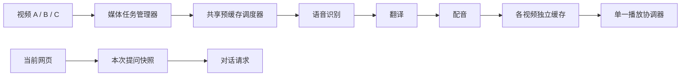

# PageLens 侧栏改版开发说明

- 日期：2026-09-15
- 设计基线：本轮第 4 版交互设计稿
- 状态：待实施。本文和图片用于开发交接；设计稿中的任务、进度、Token 和耗时均为示例，不代表真实服务结果。
- 目标：**音视频任务独立运行，对话跟随当前网页；单视频播放，多视频并行预缓存。**
- 范围：重构侧栏布局、状态归属和任务调度，保留现有能力及配置。本文不表示这些能力已经实现。
- 原有设计参考：[交互与 UI](03-interaction-ui.md)、[规划式同传](planned-interpret.md)。涉及本次改版的布局和上下文规则以本文为准。

## 1. 交付物与阅读顺序

1. 先看本节图片，理解展开、收起和上下文隔离。
2. 阅读第 3–7 节，确认交互、功能迁移、状态和并发规则。
3. 按第 9 节实施，按第 10 节验收。

[可点击交互原型](mockups/sidepanel-redesign/prototype.html)可在浏览器打开。原型不是生产代码：示例按钮只改变本地展示，不调用模型，不修改实际配置。原型图标和提示运行时依赖外部资源；静态 PNG 可离线查看。

### 图 1：音视频展开，多任务预缓存


开发指引：上方绑定视频 A；浏览器当前是文章 B；下方总结和问答使用文章 B。任务列表展示其他视频的处理进度，可独立暂停缓存。不要因为切换播放任务改变下面的网页上下文。

### 图 2：音视频收起，优先阅读与对话


开发指引：收起整个音视频区后，仍可看到正在播放的视频、状态、任务数量、后台预缓存数量和暂停按钮。收起是展示状态，不暂停播放或预缓存。

### 图 3：一键总结视频，结果不覆盖文章对话


开发指引：上方“一键总结视频”始终作用于上方选定的视频。摘要留在音视频区，附来源、耗时、Token 和收藏入口；用户点击“引用到对话”才把它作为聊天附件。

### 图 4：展开文稿与工具，主动引用视频文稿


开发指引：输入框引用标签必须体现视频名称和材料类型。主动引用优先于当前网页；移除后恢复跟随网页。图中英文、译文和任务数据是样例，不应写入产品。

### 图 5：全局设置与后台播放共存


开发指引：打开设置、历史或盘点只替换下方工作区；顶部音视频区保留。图中设置表单仅为布局示意，正式版本必须平迁现有全部配置，不能只实现图上的几项。

### 图 6：窄侧栏


开发指引：主要适配 320–420 CSS px。图标不能挤出屏幕；输入框固定在侧栏底部。展开的任务列表可以内部滚动，但不能把对话输入框顶到窗口外。浏览器页签和左侧文章仅用于解释场景，不属于扩展实现范围。

## 2. 问题与不可破坏的规则

### 2.1 当前问题

现有 `extension/sidepanel/app.js` 大量逻辑共用 `state.tab`、`state.pack`。上一轮为维持播放，在 `refreshTab()` 中提前返回，把整个页面上下文锁在播放视频上，导致切到文章后总结仍然使用视频。

另外，纯享队列、下载来源、字幕回写、控制按钮与当前 `state.tab` 绑定；仅删除提前返回会再次造成播放被清理、事件被丢弃或缓存串页。必须先拆状态，再恢复网页上下文刷新。

### 2.2 必须满足

1. 浏览网页不改变媒体任务的来源和生命周期。
2. 媒体事件不写入另一页面的正文、字幕、附件或对话。
3. 同时只有一个媒体任务输出声音；多个任务可同时准备文稿与配音。
4. 停止回答、新建对话、打开历史/设置/日志/盘点不取消媒体任务。
5. 每个请求及工具操作都有固定的来源身份，不在执行中读取可变的“当前标签页”。
6. 一键总结视频与总结本页是两个明确动作；两个入口不共用隐式目标。
7. 保留现有功能、历史记录、缓存和设置；不能以简化 UI 为由删除能力。

## 3. 布局与交互规范

### 3.1 全局顶部

一行：品牌 + 新对话、历史会话、日志、盘点、设置图标。

- 图标使用本地打包的线性图标，约 16px；不保留原来的文字导航条。
- 鼠标悬停和键盘聚焦均显示名称，按钮具备 `aria-label`。触屏不依赖 hover 才能操作。
- 命中区建议 28–32px；触屏适当扩大。图标按钮与交互面板不能横向溢出。
- 新对话清理聊天输入、临时引用和消息展示，不清理媒体任务。
- 历史恢复原消息及每条消息的来源；下一条新消息默认使用当前页面，不能隐式恢复一个旧视频引用。
- 日志支持选择媒体任务／对话请求查看和导出；盘点保留原有每日/每周及相关知识复盘能力。

### 3.2 音视频区：两级展开

| 层级 | 内容 | 收起后的行为 |
|---|---|---|
| 整个音视频区 | 播放模式、原音、摘要、任务列表、用量、文稿工具 | 只显示紧凑播放条；所有任务继续 |
| 文稿与工具／任务列表 | 字幕编辑、缓存下载等；多个视频状态 | 隐藏详情，不取消任务 |

建议首次发现视频但没有运行任务时展示“为当前视频开启同传／纯享／预缓存”入口；只有文章且没有任务时隐藏音视频区。首次启动任务可展开，后续保留用户折叠选择，不因切换网页强制展开。

常驻内容：

- 当前媒体任务的标题及“返回视频”图标。
- 同声传译／纯享音频切换，选中状态清晰。
- 原音开关，显示实际状态；用户选择在句间、缓冲、切换网页后仍生效。
- 暂停／继续、进度和倍速。
- “一键总结视频”、文稿与工具、Token 和处理耗时。

纯享模式连续播报中文，不受源视频播放进度驱动。同传与纯享之间切换保留已经生成的缓存，不能启动两个声音输出。纯享中源视频默认暂停；开原音不应偷偷恢复视频或创建第二个播放时钟。无可用原音输出时按钮置灰并说明“视频已暂停”，保留下一次同传的原音偏好。

### 3.3 网页对话

- 当前上下文卡明确显示标题、来源和“跟随当前标签页”。
- 普通网页总结走正文；视频页走完整字幕/文稿；PDF 沿用现有提取能力。不得让所有“总结本页”都调用视频转写。
- 输入框附近显示本次引用材料；附件、截图、快捷指令等现有能力保留。
- 每条回答尾部保留 Token、耗时、来源、收藏、复制、写入 Obsidian。
- 收藏以该回答携带的来源和内容为准，不能在点击收藏时读取另一个新激活网页。

### 3.4 操作效果

| 用户操作 | 音视频侧 | 对话侧 |
|---|---|---|
| 视频 A 同传时切文章 B | A 继续 | 当前上下文变 B |
| 点击下方总结本页 | 不受影响 | 总结 B |
| 点击上方总结视频 | 总结选定的视频 A，结果在上方 | 文章对话不被覆盖 |
| 主动引用 A 文稿 | 不改变播放 | 下一次提问使用引用快照 |
| 移除引用 | 不改变播放 | 下一次提问恢复使用 B |
| B 回答生成中切 C | 不受影响 | 当前卡片变 C；B 的在途回答仍用 B |
| 切换播放至视频 D | A 暂停，D 播放，缓存继续 | 仍然是当前网页 B/C |
| 点击返回视频 | 激活对应的视频标签页 | 因真正发生页签切换而更新上下文 |

## 4. 功能迁移清单

开发时逐项确认旧入口、旧快捷方式、事件绑定和新位置，不能以设计稿未展开为由遗漏。

| 现有能力 | 新位置／归属 |
|---|---|
| 新对话、历史会话 | 全局顶部图标 |
| 导出调试日志 | 全局日志面板，选择来源后导出 |
| 知识复盘／盘点 | 全局盘点图标；平迁原流程 |
| 设置、模型测试、本机服务状态 | 全局设置；完整表单平迁 |
| 写入 Obsidian | 回答尾部，并保留整段对话导出能力 |
| 同声传译、纯享音频、原音开关 | 音视频常驻控件 |
| 暂停、倍速、进度、返回源视频 | 当前播放任务控件 |
| 一键总结视频 | 音视频区；任务级摘要结果 |
| 完整生成、下载、只要文稿 | 文稿与工具 |
| 实时双语字幕、修改本句配音 | 文稿与工具 |
| 清缓存、重新配音、对齐配音、切换画面 | 更多视频操作，显式指定媒体任务 |
| 多视频任务查看、预缓存进度 | 视频任务列表 |
| 总结网页、总结 PDF | 对话上下文区的总结本页 |
| 收藏／剪藏、复制 | 回答尾部，保留现有收藏对话框及笔记/书签选项 |
| 截图、附件、快捷指令、技能入口 | 输入框周边，保留现有交互 |
| 不分享页面／移除上下文、召回笔记提示 | 当前网页上下文区 |
| Token、耗时、推理展示、执行步骤 | 保留现有回答信息，扩展媒体任务统计 |
| 权限确认、停止执行、历史持久化 | 保留现有逻辑，仅更换视觉容器 |

## 5. 状态拆分和来源隔离

以下名称为建议接口，不是已经存在的代码。

```ts
type SourceRef = {
  tabId: number;
  url: string;
  title: string;
  navigationId: string; // 同一个 tab 内导航也生成新身份
  videoId?: string;
  frameId?: number;
  playerId?: string;   // 同一页面多个播放器必须区分
};

type WorkspaceState = {
  page: { source: SourceRef | null; pack: PagePack | null;
          revision: number; loading: boolean; error?: string };
  chat: { conversationId: string; messages: Message[];
          attachment: ContextSnapshot | null; requests: Map<string, ChatRequest> };
  media: { tasks: Map<string, MediaTask>; activePlaybackTaskId: string | null };
  ui: { activeView: string; mediaExpanded: boolean;
        tasksExpanded: boolean; selectedMediaTaskId: string | null };
};
```

### 5.1 当前网页

`refreshPageContext()` 只更新 `page`，不能停止任何媒体任务或操作媒体播放器。

- 页签激活、窗口目标变化或 URL 导航时增加 `revision`，立即清空旧页 `pack`，进入 loading。
- 每个异步提取请求捕获 `revision`、`tabId` 和 URL。返回值仅在三者匹配时写回。
- 新页读取失败、受限网页、加载超时时显示明确状态；不能回退到上一视频正文继续总结。
- “总结本页/发送”捕获当时的来源并取得对应材料；提取完成时即使用户换页，也只供这次请求使用。

### 5.2 本次对话请求

发送时创建不可变 `ContextSnapshot`，记录来源、正文／字幕版本、附加材料及时间。

- 有显式引用时采用引用快照；否则使用当前页材料。
- 工具执行绑定该请求的 `SourceRef`；禁止 `getTabId: () => state.tab.id` 这类在执行中更换目标的实现。
- 抓图、跳转引用、收藏、回答里的时间戳同样携带自己的来源身份。
- 历史保留每条消息的来源；更换页面不删除历史，也不能把历史中的旧页面当作本次默认正文。
- 新对话后旧请求如仍有回调，仅能更新旧会话，不能写入新对话。

### 5.3 媒体任务

每个 `MediaTask` 包含固定来源、runId、缓存键、文稿、配音队列、原音偏好、摘要、统计和两个独立状态：

```ts
prepareState: 'idle' | 'queued' | 'running' | 'paused' | 'complete' | 'error';
playbackState: 'idle' | 'buffering' | 'playing' | 'paused' | 'ended' | 'error';
```

- `pausePlayback(taskId)` 不等于 `pausePreparation(taskId)`，也不等于取消任务。
- 事件携带 `taskId + runId`；接收方检查运行代次，防止取消后迟到结果污染重新开始的任务。
- 纯享队列、播放头、自动播放状态、完整音频 archive 都移入任务，不能继续使用一组全局变量代表所有视频。
- 字幕/配音完成事件只更新该任务及其缓存，不直接调用全局 `applyCaptions()` 写当前页。
- 媒体摘要有独立请求和结果区；原型示意为当前任务摘要，正式实现应保存到对应任务，切换后可以恢复。

## 6. 单播放、多视频并行预缓存

### 6.1 添加任务

“添加视频”打开已发现的视频列表，按标签页、标题、播放器区分。没有视频的文章页不列入。选择后可以“仅预缓存”；不会自动激活源标签、暂停其他视频或开始出声。

同一视频重复添加复用已有任务；同一 tab 导航到新视频创建新来源。任务身份不能仅用 tabId。

### 6.2 调度建议

- 新增 `MediaTaskManager`、`PlaybackCoordinator` 和共享 `PreparationScheduler`。
- 播放协调器全局最多一个音频所有者。切换时先暂停旧中文音轨和原音输出，再接管新任务；用切换代次防止快速点击导致双播放。
- 默认允许 2 个后台视频同时预缓存，其余显示排队；当前播放任务优先保障连续缓冲。此并发数为实施建议，可按服务能力配置。
- ASR、翻译、TTS 按服务端点分别限流，不能为每个视频各开一套无限并发。
- 当前播放任务缓冲不足时，暂停派发较低优先级的后台新请求；正在执行的请求可完成并入缓存。恢复缓冲后继续后台任务，避免长期饥饿。
- 缓存暂停停止派发新分段，已完成结果保留。取消任务才中断其在途请求；失败只影响当前任务，不取消其他任务。
- 对话拥有独立的取消控制；不要被长视频转换完全占满模型请求槽位。



### 6.3 预缓存与源播放器解耦

当前 `InterpretController.start()` 会探测并暂停播放器，不能直接作为“后台预缓存”入口复用。

- 抽离下载、识别、翻译、TTS、缓存的纯准备流程。后台准备不能调用页面暂停、播放、seek、静音。
- 已下载/可独立读取音轨可后台并发预缓存。仅支持实时标签捕获的来源不能声称离线预缓存，应明确标记“需打开源视频并授权取声”，不偷偷切换浏览器标签。
- 缓存完成定义为：整个来源范围已处理、所需译文/配音就绪且成功持久化。部分识别失败、未覆盖范围或保存失败不能显示完整 100%。
- 区分“缓存覆盖率”和“播放进度”。同时显示当前阶段、已就绪分段、可播放范围。
- 存储继续使用已有 IndexedDB 缓存；播放队列只解码近期分段，避免把多个长视频的 PCM 全留在内存。
- 关闭源 tab：下载音轨已独立持有时可继续准备／纯享；依赖源页的同传停止并提示。源导航和关闭不得让任务操作新页面。

## 7. Token 与耗时

| 范围 | 默认展示 | 展开详情 |
|---|---|---|
| 每条回答 | 总 Token、总耗时 | 输入、输出、首字耗时（能测量时） |
| 视频摘要 | 本次摘要 Token、耗时 | 输入、输出、失败／重试用量 |
| 视频任务 | 本次处理累计 Token、处理耗时 | 按 ASR／翻译／TTS、缓存复用、排队等拆分 |
| 任务列表 | 各任务用量、耗时和进度 | 点击任务查看对应明细 |

统计要求：

- 保留 `createMessageFooter()` 现有输入/输出 Token 和时长能力，重排布局而非删除字段。
- 模型返回 usage 时优先使用；估算值必须标“估算”；无法取得用量显示“—”，不是 0。
- 当前视频摘要代码有本地 `estimateTokens()` 路径，迁移时不能把估算展示为服务端实际用量。
- ASR 音频秒数、TTS 字符数/音频秒数单独计量，不强行折算成 Token。
- 每个实际请求有 requestId，结果只入账一次；重试产生的实际用量计入对应任务。
- 读取已有缓存不新增模型 Token；历史生成成本与本次用量分开。
- 视频处理耗时与视频时长、播放时长不同。记录开始/结束、等待、暂停和实际处理区间；并行步骤总墙钟时间不能直接求和。
- 首字耗时无法测量时不显示；失败和取消也保留已消耗用量及截至当时的耗时。
- 图中数值只用于排版验收，禁止硬编码。

## 8. 视觉与布局约束

- 延续暖白背景、橙色强调、细线分隔和系统字体；沿用现有设置中的字号偏好。
- 图标资源本地打包，正式扩展不得依赖原型的 CDN 脚本和内联执行方式。
- 图标 hover/focus 提示功能名；原音、播放和模式按钮有可访问的状态标签。
- 源标题过长可省略，悬停或展开能查看完整标题。
- 侧栏为垂直 flex：全局栏固定、媒体区有最大高度、消息区占剩余空间、输入框保持可见。
- 当媒体详情过长，使用详情区域滚动或独立详情视图。设计图为信息布局，不代表真实界面要把整张长图堆成不可用的滚动页面。
- 媒体区全部收起与内部“任务列表收起”是不同偏好，分别保存。
- 设置/历史/盘点视图保持输入草稿和原来的对话滚动位置；返回后恢复。

## 9. 实施路径与代码定位

本节为当前仓库定位；模块拆分名称可按实现调整。

| 当前文件 | 改动重点 |
|---|---|
| `extension/sidepanel/index.html` | 顶部图标、媒体容器、任务列表、摘要区、独立上下文卡、回答尾部 |
| `extension/sidepanel/styles.css` | 折叠布局、状态、窄屏、固定输入框、图标提示 |
| `extension/sidepanel/app.js` | 拆 `state.tab/pack`，移除刷新时媒体清理和提前锁页；事件按请求/任务路由 |
| `extension/sidepanel/interpret-controller.js` | taskId/runId；准备和播放分离；独立原音偏好 |
| `extension/lib/planned-interpret.js` | 抽纯准备流程；共享限流；事件归属；禁止预缓存操作页面播放 |
| `extension/lib/streaming-audio-player.js` | 每任务队列与共享单播放协调；暂停不丢缓存 |
| `extension/lib/video-pick.js` | 保留原音门控；目标绑定具体播放器与来源 |
| `extension/lib/dub-cache.js` | 复用缓存，完整性标记，任务级隔离与清理 |
| `extension/lib/downloaded-audio-source.js` | 独立音轨来源与后台准备生命周期 |

建议分阶段交付：

1. **来源隔离**：建立 page/chat/media 状态边界；请求快照和过期写回防护。先让文章总结与原同传同时工作。
2. **任务准备解耦**：把纯享全局变量移入任务，分离准备与播放，实现共享服务限流和单播放所有权。
3. **界面平迁**：按图迁移顶部、折叠媒体区、任务列表、摘要、设置、回答尾部和所有既有入口。
4. **统计与持久化**：沿用消息 metrics，补任务计量；会话数据缺新字段时兼容回退，不能清空历史或已有视频缓存。
5. **回归与实机验收**：覆盖第 10 节。功能迁移清单逐项签收后再替换旧入口。

侧栏关闭后是否继续运行与“切换标签页”是不同生命周期要求。本次必须保证切页和切换侧栏内部视图不中断；若增加关闭侧栏仍运行，需要将任务运行所有权移到合适的长寿命执行环境，不能靠 UI 折叠假装实现。实现前确认现有后台/offscreen能力，不在本次文档中宣称已支持。

## 10. 验收标准

### 10.1 上下文与竞态

- [ ] A 同传 → 切文章 B → 总结：结果来自 B，A 继续播放。
- [ ] B 提取未完成就切 C：B 的迟到结果不覆盖 C；B 已提交请求仍得到 B 的内容。
- [ ] 新网页提取失败：不使用上一页缓存冒充新内容。
- [ ] 显式引用 A → 切 B/C：发送使用引用；移除后使用当前网页。
- [ ] A 字幕/配音完成时当前是 B：只更新 A 任务，不把字幕写进 B。
- [ ] 历史消息收藏、截图引用、视频时间戳均操作原来源；源已失效时提示，不操作当前页。

### 10.2 播放与后台准备

- [ ] A 播放，B/C 并行预缓存；下方可以正常提问、总结和停止回答。
- [ ] 暂停 B 缓存不影响 A/C；恢复后复用已完成分段。
- [ ] 快速点击切换 A/B/C：最终只有最后选中的任务输出声音。
- [ ] 切换播放不取消原任务的准备，不强制把浏览器激活到新视频。
- [ ] 同传/纯享切换不双播、不重复提交已缓存分段；原音偏好不被句间恢复覆盖。
- [ ] 添加重复来源复用任务；不同播放器或导航后的新来源可区分。
- [ ] 预缓存不调用源页面播放/暂停；不支持独立取声的来源显示明确限制。
- [ ] 网络错误、鉴权错误、ASR 异常重复、配音失败只影响所属任务。
- [ ] 未完成内容、部分识别失败或保存失败不能显示完整缓存。

### 10.3 UI 与功能完整性

- [ ] 全局图标 hover/focus 名称完整；设置、日志、盘点、历史入口可达。
- [ ] 整个媒体区可折叠，折叠后仍能暂停/继续且看到后台任务数。
- [ ] 一键总结视频使用选定任务，并在上方展示结果，不覆写文章回答。
- [ ] 每条回答及媒体任务均展示真实／明确标识估算的用量与耗时。
- [ ] 320、360、420px，大小字号、浅色/深色主题下无横向溢出；输入框始终可达。
- [ ] 逐项核对第 4 节，历史配置、快捷操作、收藏选项和模型测试均未丢失。

测试建议：

- 新增页面来源隔离、迟到事件、播放所有权、并发队列限流、分任务统计测试。
- 将上一轮 `test_playback_tab_switch.mjs` 的“锁定整个 state.tab”断言改为“媒体绑定 A、page 更新 B”。旧断言已不符合新架构。
- 扩展 `test_pure_audio_isolation.mjs`、`test_interpret_controller.mjs`、`test_planned_interpret.mjs` 和现有 metrics 测试。
- 最后在 Chrome 实测一个正在播放的视频、两个后台预缓存任务和一个文章页；自动化模拟不能代替这一轮验证。
